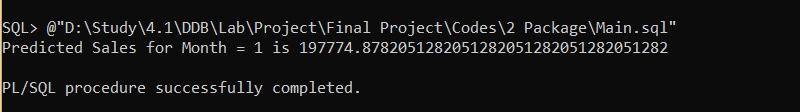

# Go-Cart
A PL-SQL Project based on super shop

## Features

1.	Customer buys product, local store sells product, and therefore transaction happens.
2.	Customer can be approved for membership.
3.	Customer can search item for information and reliability.
4.	Warehouse has product inventory.
5.	Warehouse can distribute products to local store.
6.	There is monthly, weekly and daily sales report.
7.	Customer can search in different stores for product availability.
8.	Customer can see top selling products of specific category

## Platforms

1.	Programming Language :  PL-SQL

2.	Database:  Oracle SQL

## Relational Model with Fragmentation Schema
### Global Schema
1. Branch(branch_ID, Location, Phone)
2. Category(C_ID, C_Name)
3. Membership(M_ID, P_Range_From, P_Range_To, Discount_Rate, Type)
4. Product(P_ID, Selling_Price, P_Name, C_ID)
5. Customer(C_ID, C_Name, Email, M_ID)
6. Transaction(T_ID, Cust_ID, Branch_ID, Total_Price, T_Date)
7. goes_in(P_ID, T_ID, Quantity)
8. occurs_in(Branch_ID, T_ID)
9. proceed(T_ID,C_ID)
10. stores_in(P_ID, P_Quantity, Branch_ID)
11. warehouse(S_ID, S_Date, P_ID, P_Quantity, Buying_Price)
12. Sales(Serial_no, Month, Sales)

### Fragmentation Schema
1. Branch1 = PJbranch_ID,Location,PhoneSLLocation=’Dhanmondi’Branch
2. Branch2 = PJbranch_ID,Location,PhoneSLLocation=’Mohammadpur’Branch
3. Stores_in1 = PJP_sID, P_Quantity, Branch_IDSLBranch_ID = 1 stores_in
4. Stores_in2 = PJP_ID, P_Quantity, Branch_IDSLBranch_ID = 2 stores_in
5. Transaction1 = PJT_ID,Cust_ID,Branch_ID,Total_Price,T_DateSLBranch_ID = 1 Transaction
6. Transaction2 = PJT_ID,Cust_ID,Branch_ID,Total_Price,T_DateSLBranch_ID = 2 Transaction
7. Branch1 @ site1, Stores_in1 @ site1, Transaction1 @ site1
8. Branch1 @ site1, Stores_in1 @ site1, Transaction1 @ site1

## Machine Learning Technique

In procedure 6, we used a machine learning technique called linear regression to
predict the sales outcome for any month.
Our dataset includes 2 columns (Month = x, Sales = y). So for month, x = 1, 2…12
we inserted sales value y.
Then we calculated values by using the regression formula for a and b. Then for
any month, x = 1 = January we calculated y = a + bx and found the predicted
score.

Output of forecasted sale of month 1 = January

## References
1. Oracle Database 10g 
2. Distributed Databases - Principles and Systems (Stefano Ceri)

